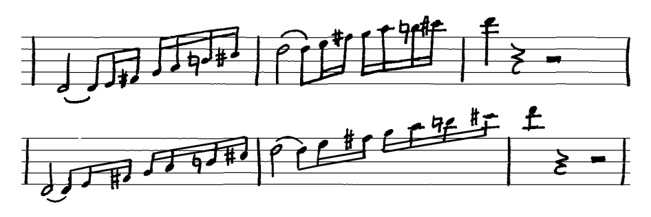
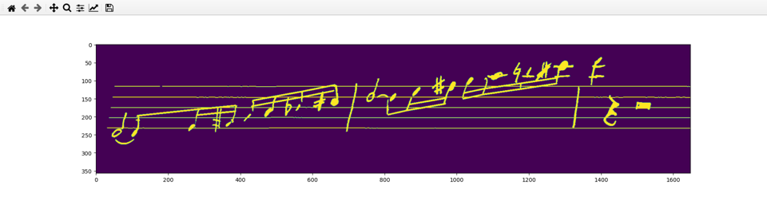
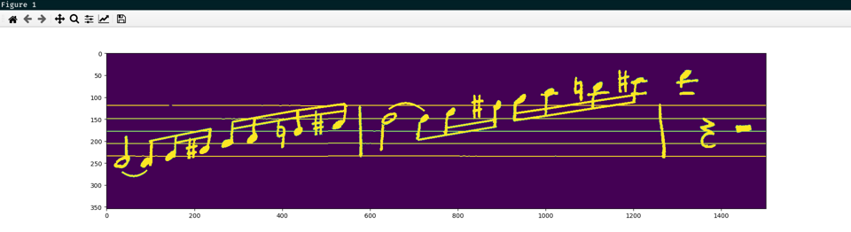
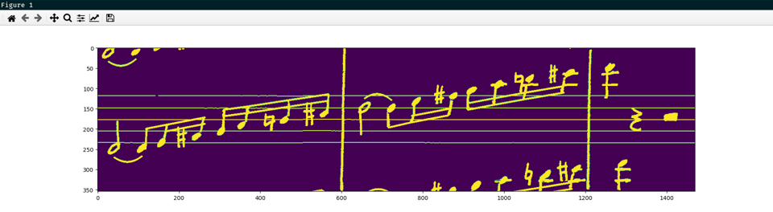
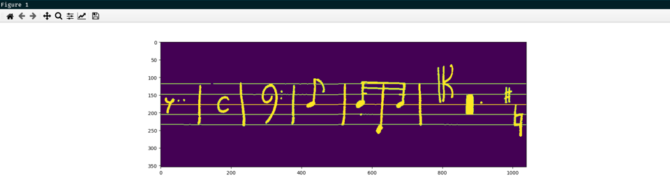
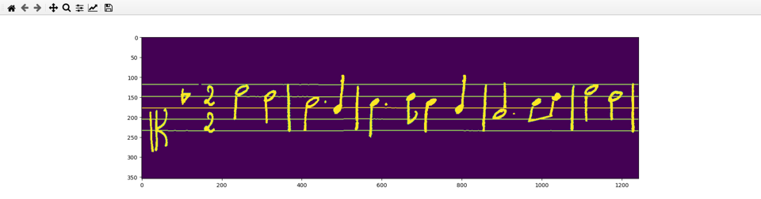

# Mashcima

A Python library that produces synthetic images of monophonic handwritten music. One of the following two images is synthetic, take a guess:



The upper image is taken from the [CVC-MUSCIMA dataset](http://www.cvc.uab.es/cvcmuscima/index_database.html) \[3\] and the lower image was synthesized by this tool.

The aim of this tool is to provide abundant training data for researchers in the field of handwritten music recognition. It works by taking symbol masks from the [MUSCIMA++ dataset](https://ufal.mff.cuni.cz/muscima) \[2\] and placing them onto a blank staff according to a given annotation. This annotation may be your own, may be generated randomly, or may be taken from the [PrIMuS dataset](https://grfia.dlsi.ua.es/primus/) \[4\].

> This tool is described in detail in the article *Synthesizing Training Data for Handwritten Music Recognition* \[1\] which can be downloaded here: `<not-yet-published>`
>
> The article describes various experiments. These experiments are part of the old repository: https://github.com/Jirka-Mayer/BachelorThesis


## Installation

The tool can be installed via pip:

    pip install mashcima

It will automatically download all the necessary datasets upon first usage, so expect additional 1.5 GB of disk space to be taken up. Also have an internet connection ready (~350MB will be downloaded).

> **Note:** Check out the [uninstallation](#uninstallation) section on how to clear this data.


## Usage (short tutorial)

To visualise the generated images, we will use the `matplotlib` package:

    pip install matplotlib

Now we can write a few lines of code to generate an image from a given Mashcima annotation:

```py
import mashcima as mc
import matplotlib.pyplot as plt

# the input annotation
annotation = "h-5 ( ) e=-5 =s=-4 #-3 =s-3 s=-2 =s=-1 N0 =s=0 #1 =s1 | " + \
    "h2 ( ) e=2 =s=3 #4 =s4 s=5 =s=6 N7 =s=7 #8 =s8 | q9 qr hr"

# turn the annotation into an image
img = mc.synthesize_for_training(annotation)

# display the image
plt.imshow(img)
plt.show()
```



The `synthesize_for_training` function generates an image with additional affine distortion and random gaps between notes. This method should be used for generating training images. We can also generate images that are primarily good looking:

```py
# constraint symbol repository to the writer 01
# (from the MUSCIMA++ dataset, used as the source of symbols)
mc.use_only_writer_number_one()

# synthesize with no distortions
img = mc.synthesize_for_beauty(annotation)
```



We told the synthesizer to use only symbols taken from the writer 01 of the MUSCIMA++ dataset. This writer has the best looking handwriting. The `synthesize_for_beauty` synthesizes without any awkward looking distortions.

We can also synthesize the surrounding staves of music, so that the resulting image looks like it was cropped from a music sheet:

```py
# render the surrounding staves as well
img = mc.synthesize_for_beauty(
    above_annotation=annotation,
    main_annotation=annotation,
    below_annotation=annotation,
)
```



Now that we can turn an annotation into an image, we need to obtain these annotations from somewhere. One option is to generate them pseudo-randomly:

```py
img = mc.synthesize_for_beauty(
    mc.generate_random_annotation()
)
```



Another option is to load the [PrIMuS dataset](https://grfia.dlsi.ua.es/primus/) and use its annotations as a source:

```py
print(mc.load_primus_as_mashcima_annotations(take=5))
```

This function returns the following data:

```py
[
    {
        'path': './package_aa/000104290-1_1_1/000104290-1_1_1.agnostic',
        'primus': 'clef.C-L1\taccidental.flat-L4\tdigit.2-L4\td...',
        'mashcima': 'clef.C-4 b2 time.2 time.2 h3 h2 | h1 * q0 ...'
    },
    { ... },
    { ... },
    { ... },
    { ... }
]
```

As you can see, it loads individual incipits and provides them in both the PrIMuS agnostic encoding and the Mashcima encoding. We can use these annotations to generate images:

```py
# you can omit the "take=5" argument to load the whole dataset
data = mc.load_primus_as_mashcima_annotations(take=5)

img = mc.synthesize_for_beauty(
    data[0]["mashcima"]
)
```



If you have your own music in the PrIMuS agnostic format, you can convert it to Mashcima encoding via:

```py
# prints "clef.G-2 #4 #1 time.C"
print(mc.convert_primus_annotation_to_mashcima_annotation(
    "clef.G-L2\taccidental.sharp-L5\taccidental.sharp-S3\tmetersign.C-L3"
))
```

The conversion is not perfect, for example grace notes are skipped and multi-measure rests cause the whole conversion to fail, returning `None`. But most notes and rests are converted correctly. See the [`primus_adapter.py`](mashcima/primus_adapter.py) source code.


## Synthesis in detail

Both synthesizing functions (`synthesize_for_training` and `synthesize_for_beauty`) internally use the `synthesize` function. This function has many arguments that tweak the synthesis process:

| Argument | Default | Description |
| -------- | ------- | ----------- |
| `main_annotation` | `---` | The string annotation for the main staff to render. |
| `above_annotation`,<br>`below_annotation` | `None` | Optional annotations for staves above and below the main one. |
| `main_canvas_options`,<br>`above_canvas_options`,<br>`below_canvas_options` | `None` | [`CanvasOptions`](mashcima/CanvasOptions.py) objects to be passed to the rendering process of each of the three staves. |
| `min_width` | `0` | Typically, the image is cropped horizontally to the width of its content. You can specify minimal width below which the image will not be cropped. |
| `crop_horizontally`,<br>`crop_vertically` | `True` | The image is rendered onto a large image with all three staves and then cropped to only the main staff. You can disable this cropping in each direction. |
| `transform_image` | `True` | A random affine distortion may be applied to the rendered image. |
| `symbol_repository` | `None` | The repository from which to obtain symbols. `None` stands for the default repository. |

To learn more about the synthesis process, read the article: `<not-yet-published>`.


## Uninstallation

Since Mashcima downloaded two datasets and cached some temporary data for faster loading, you need to run the following command before uninstalling the pip package to remove this data:

    python -m mashcima.delete_files

Now you can do:

    pip uninstall mashcima


## License

The sourcecode of this tool falls under the [MIT](LICENSE) license.

Since the synthesis uses the MUSCIMA++ dataset, which in turn uses the CVC-MUSCIMA dataset, it means that the synthesized images fall under the [Creative Commons Attribution-NonCommercial-ShareAlike 4.0 International License](https://creativecommons.org/licenses/by-nc-sa/4.0/).

The PrIMuS dataset is created from the [RISM](http://opac.rism.info/) dataset, which falls under the [Creative Commons Attribution 3.0 Unported License](https://creativecommons.org/licenses/by/3.0/), and so this license should also apply to images synthesized from PrIMuS annotations.

The CVC-MUSCIMA dataset is for non-commercial research purposes only, which implies that the same restrictions apply to images generated by Mashcima.

**Reference:**<br>
If you publish material based on this tool, we request you to include a reference to paper \[1\]. Due to the transitive usage of MUSCIMA++ and CVC-MUSCIMA, you should also include references to \[2\] and \[3\]. If you use the PrIMuS dataset, you should also cite \[4\].


## References

\[1\] `<not-yet-published>` Jiří Mayer and Pavel Pecina. Synthesizing Training Data for Handwritten Music Recognition. *16th International Conference on Document Analysis and Recognition, ICDAR 2021.* Lausanne, September 8-10, pp. `<not-yet-known>`, 2021.

\[2\] Jan Hajič jr. and Pavel Pecina. The MUSCIMA++ Dataset for Handwritten Optical Music Recognition. *14th International Conference on Document Analysis and Recognition, ICDAR 2017.* Kyoto, Japan, November 13-15, pp. 39-46, 2017.

\[3\] Alicia Fornés, Anjan Dutta, Albert Gordo, Josep Lladós. CVC-MUSCIMA: A Ground-truth of Handwritten Music Score Images for Writer Identification and Staff Removal. *International Journal on Document Analysis and Recognition*, Volume 15, Issue 3, pp 243-251, 2012. (DOI: 10.1007/s10032-011-0168-2).

\[4\] Jorge Calvo-Zaragoza, David Rizo. End-to-End Neural Optical Music Recognition of Monophonic Scores. *Applied Sciences* **8**(4), 606 (2018)


## Contact

Jiří Mayer ([mayer@ufal.mff.cuni.cz](mailto:mayer@ufal.mff.cuni.cz))

This tool has also been created thanks to Pavel Pecina and Jan Hajič jr.
